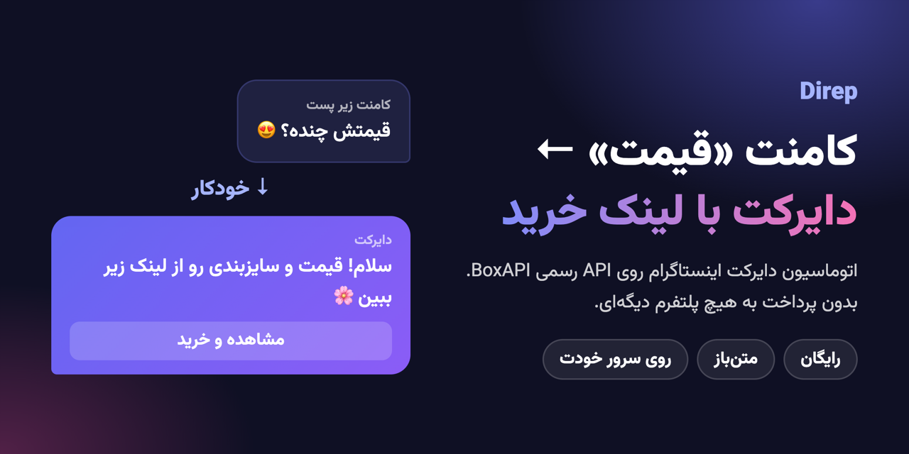
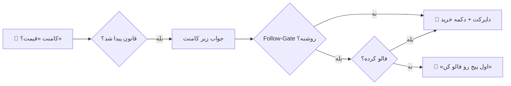
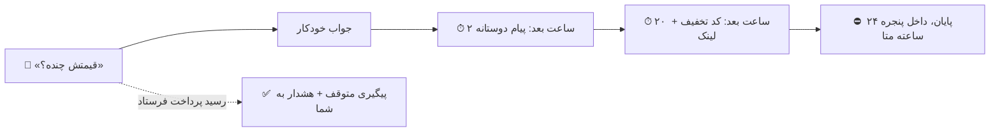

<div dir="rtl">

<p align="center">
  
</p>

<p align="center">
  <a href="LICENSE"></a>
  
  
  
  
</p>

# Direp

**اتوماسیون دایرکت و کامنت اینستاگرام برای فروشگاه‌های ایرانی. رایگان، متن‌باز، روی سرور خودتون.**

بیشتر ابزارهای اتوماسیون دایرکت دو بار پول می‌گیرن: یه بار شما برای API اینستاگرام پول می‌دید، یه بار هم برای پلتفرمی که روی همون API ساخته شده.

Direp مستقیم به [API رسمی BoxAPI](https://boxapi.ir) وصل می‌شه. **فقط اشتراک BoxAPI رو دارید** (پلن پایه ماهانه ۷۹۰ هزار تومن، ۷ روز رایگان) و برای هیچ پلتفرم دیگه‌ای پول نمی‌دید.

---

## چی کار می‌کنه

### ۱. کامنت به دایرکت (با Follow-Gate)



### ۲. پیگیری کسی که قیمت پرسید و نخرید



### بقیه امکانات

| | |
|---|---|
| 🧠 **فهم دایرکت** | سؤال قیمت، سایز، پیگیری سفارش، رسید پرداخت و شکایت رو تشخیص می‌ده. **فینگلیش هم:** «gheymat chande?» |
| 🔔 **هشدار در بله یا تلگرام** | شکایت مشتری و رسید پرداخت فوری به گوشی‌تون میاد. بله بدون فیلترشکن کار می‌کنه. |
| 👥 **لیست مشتری‌ها** | کی قیمت پرسید، کی خرید، کی شکایت داره، شماره‌ای که توی دایرکت داده. |
| ✍️ **متن‌ها دست خودتون** | هر جواب خودکار رو مطابق فروشگاه خودتون می‌نویسید یا خاموش می‌کنید. |
| 🔒 **امن** | کلید BoxAPI فقط روی سرور شما. امضای رسمی وب‌هوک BoxAPI بررسی می‌شه. پیام تکراری دوبار جواب نمی‌گیره. |
| 🇮🇷 **مخصوص ایران** | فارسی و راست‌چین، شماره موبایل ایرانی، بدون CDN خارجی (فونت وزیرمتن داخل پروژه‌ست). |

---

## Direp در مقایسه با ابزارهای پولی

| | **Direp** | ابزارهای پولی دیگه |
|---|:---:|:---:|
| هزینه ماهانه جدا از BoxAPI | **۰ تومن** | از حدود ۳۵۰ هزار تا چند میلیون تومن |
| کد متن‌باز | ✅ | ❌ |
| نصب روی سرور خودتون (لیست مشتری‌ها دست خودتون) | ✅ | ❌ |
| هشدار در **بله** | ✅ | ❌ ندیدیم |
| فهم **فینگلیش** | ✅ | ❌ ندیدیم |
| کامنت به دایرکت | ✅ | ✅ |
| Follow-Gate (فقط برای فالوورها) | ✅ | ✅ بعضی‌ها |
| پیام پیگیری بعد از پرسیدن قیمت | ✅ | ✅ بعضی‌ها |
| فرم‌ساز، پیامک انبوه، ویترین، پیام صوتی | ❌ | ✅ بعضی‌ها |

> «ندیدیم» یعنی توی سایت این ابزارها (مهر ۱۴۰۵) پیدا نکردیم. اگه اشتباهه خبر بدید تا اصلاح کنیم.

---

## نصب

**لازم دارید:** حساب [BoxAPI](https://boxapi.ir/pricing) با سرویس «API رسمی دایرکت و کامنت»، یه سرور (VPS) با Docker، و یه دامنه با HTTPS.

```bash
git clone https://github.com/Mahdi-Khalili-Marketing/direp.git
cd direp
cp .env.example .env        # PUBLIC_URL = آدرس دامنه شما
docker compose up -d --build
```

برنامه روی `127.0.0.1:3000` بالا میاد. پشت یه وب‌سرور با HTTPS بذاریدش. با [Caddy](https://caddyserver.com) (SSL رو خودش می‌گیره):

```
direp.example.ir {
    reverse_proxy 127.0.0.1:3000
}
```

<details>
<summary>نصب بدون Docker</summary>

```bash
npm ci && npm run build
cp .env.example .env
npm start
```
Node.js نسخه ۲۲.۱۳ به بالا لازمه.
</details>

### راه‌اندازی در ۴ قدم

1. دامنه رو باز کنید و حساب مدیر رو بسازید (شماره موبایل و رمز).
2. کلید BoxAPI رو از پنل BoxAPI، بخش «تنظیمات API» وارد کنید و پیج رو انتخاب کنید.
3. آدرس وب‌هوکی که Direp نشون می‌ده رو توی پنل BoxAPI، بخش «تنظیمات API»، قسمت Webhook بذارید. (توصیه: Webhook Secret هم بسازید و توی Direp وارد کنید.)
4. اولین قانون کامنت به دایرکت رو بسازید.

---

## نکته‌ها

- **پنجره ۲۴ ساعته متا:** فقط تا ۲۴ ساعت بعد از آخرین پیام مشتری می‌شه بهش پیام داد. Direp بیرون این بازه چیزی نمی‌فرسته.
- **Private Reply** (دایرکت درباره کامنت) فقط تا ۷ روز بعد از کامنت ممکنه.
- **Follow-Gate** جوابش رو BoxAPI با وب‌هوک می‌فرسته. اگه تا ۲ دقیقه نرسید، Direp پیام اصلی رو می‌فرسته تا مشتری بی‌جواب نمونه.
- ربات قیمت واقعی محصولاتتون رو نمی‌دونه؛ متن جواب‌ها رو خودتون بنویسید.
- همه داده‌ها توی یه فایل SQLite هست: `data/direp.db`. برای پشتیبان‌گیری همین پوشه رو کپی کنید. به‌روزرسانی: `git pull && docker compose up -d --build`

## توسعه

```bash
npm install
npm test                          # ۳۹ تست
BOXAPI_DRY_RUN=true npm run dev   # هیچ پیامی واقعاً ارسال نمی‌شه
```

---

<p align="center">
ساخته‌شده روی <a href="https://boxapi.ir">API رسمی BoxAPI</a> · مجوز <a href="LICENSE">MIT</a> · فونت <a href="public/fonts/OFL.txt">وزیرمتن (OFL)</a><br>
<sub>Direp پروژه‌ای مستقله و وابستگی رسمی به BoxAPI یا Meta نداره.</sub>
</p>

</div>
